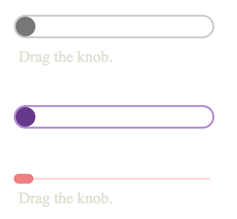

# horizontal-slider

Horizontal slider is a simple, themable slider written in ES6.

Slider examples:



Cool fact: there are no dependencies on external libraries.

# Theming

See the <strong>horizontal-slider.css</strong> for examples and <strong>index.html</strong> for usage.

# Usage

First add the <strong>horizontal-slider.css</strong> style.
```javascript
<link href="horizontal-slider.css" media="all" rel="stylesheet" />
```

Then add the slider
```javascript
<hslider id="s1" labelId='slider-text'></hslider>
<div id="slider-text">Drag the knob.</div>
```

Add the <strong>horizontal-slider.js</strong> script

```javascript
<script src="./horizontal-slider.js" type="text/javascript"></script>
```

Then finally wire the slider by calling <strong>hslider.initializeSliders()</strong>

```javascript
<script>
    hslider.initializeSliders();
</script>
```

Use <strong>slider.knob.onRangeChanged</strong> to add a callback for when the slider position has changed.

```javascript
<script>
    const slider = hslider.getSliderById("s1"); // Get the slider
    slider.knob.onRangeChanged = function(s) {  // Attach callback
        console.log("slider:foo", s.knob.range)
    }
</script>
```
